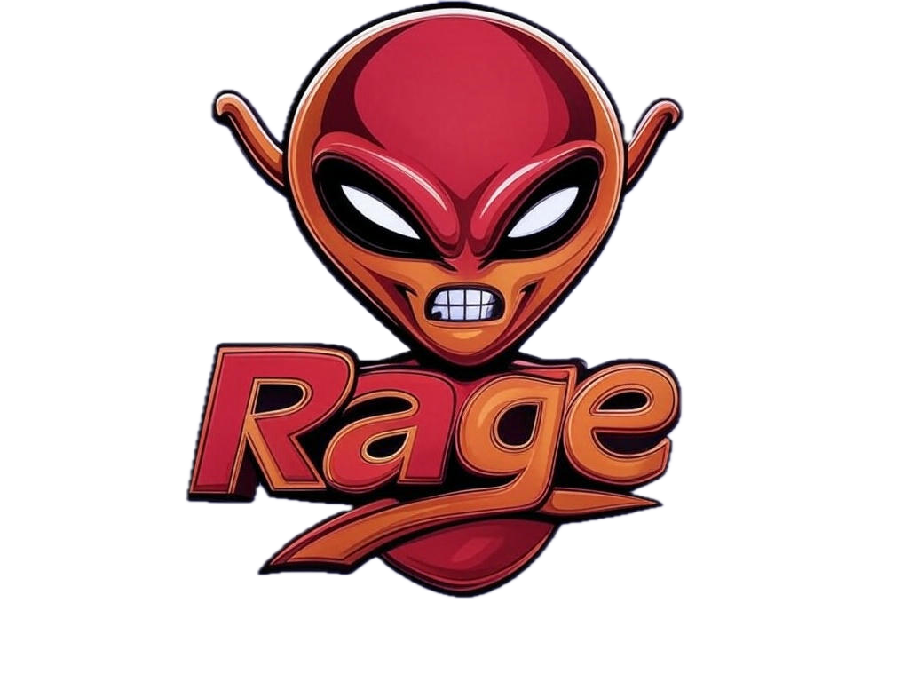

<p align="center">
   
</p>

# Rage: A Rust-Based Git Repo Manager (Like CGit/Gogs, But Cooler)

Rage is a self-hosted Git repository manager that looks a bit like Gogs or CGit. It lets you create repositories, manage users,
track issues, and collaborate with teams—basically, it's CGit but not CGit.

## Features

- 🚀 **Repository Management**: Create, clone, and manage your Git repos.
- 🔑 **User Authentication**: Secure user accounts for your instance.
- 💻 **Team Collaboration**: Organize users into teams to share repositories.
- 🛠 **Forking & Pull Requests**: Fork repos and submit PRs like the pros.
- 📝 **Issue Tracking**: Track issues, pull requests, and more.
- 🔧 **Permissions**: Fine-grained access control for repos and teams.

## Requirements

Before you dive in:

- Rust (nightly or stable version)
- `cargo` installed

---

## How to Use Rage 🚀

### Installation

1. Clone the repo:
   ```bash
   git clone https://github.com/yourusername/rage.git
   cd rage
   ```

2. Build it with Rust:
   ```bash
   cargo build --release
   ```

3. Run it (in development mode):
   ```bash
   cargo run
   ```

---

## Contributing

If you want to help out or just mess around with Rage, feel free to fork the repo and send a PR! We're all about open-source fun here.
😎

---

## Want to Chat?

Got questions or ideas? Hit me up on GitHub or join the [Discussions](https://github.com/yourusername/rage/discussions). Let's make
Rage even better!

---

## License

This project is GPL-licensed, so feel free to use and modify it as you like. Check out the `LICENSE` file for details.

---
